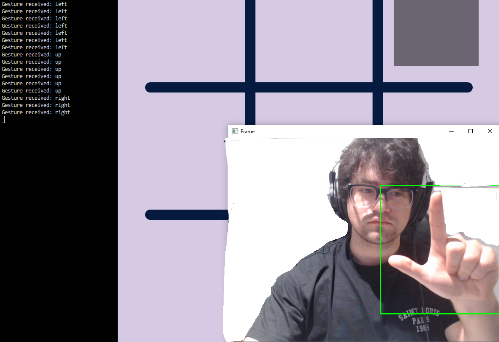

# HandControl

## The Repository 

This repository is a proof of concept for CNN based game controllers. The source code is available for everyone under the MIT license.

## HandControl Screenshots


The server returning sign predictions.
## Install Guide

### Cloning The Repository

- Prerequisites
Software: [git](https://git-scm.com/book/en/v2/Getting-Started-Installing-Git) and a terminal emulator of your choice.
Hardware: A webcam connected to the computer you're running the client on.

This command will clone the repository into your current working directory under the HandControl folder. I recommend cloning projects into a generic "Repos" directory. In general clone it into a directory where you'll be able to quickly remove the code from your machine.
```
git clone https://github.com/Mathieu-Poirier/HandControl
```
Change directory into HandControl.
```
cd HandControl
```
### Packages
To install the required Python packages run this command while in the HandControl directory.
```
pip install -r packages.txt
```
### Running The Client
Change directory into the client folder.
```
cd client
```
Run the client script
```
python .\client_async.py
```
To exit the client press the "q" key on your keyboard or click the 'X' button on the Tic-Tac-Toe GUI

## The Server Design

The server is a flask app that loads the file "converged_CNN.pth". Throught the /predict endpoint it receives the image sent by a client in a POST request and returns a json reponse of the gesture detected.
```
@app.route("/predict", methods=["POST"])
def predict():
    try:
        if "image" not in request.files:
            return jsonify({"error": "No image provided"}), 400

        file = request.files["image"].read()

        image = Image.open(io.BytesIO(file)).convert("RGB")
        image = image.resize((600, 600), Image.ANTIALIAS)

        image = np.array(image).astype(np.float32) / 255.0
        image = np.transpose(image, (2, 0, 1))  # Convert to CHW format
        image = np.expand_dims(image, axis=0)  # Add batch dimension
        image = torch.tensor(image, dtype=torch.float32).to(device)

        with torch.no_grad():
            outputs = model(image)
            _, predicted = torch.max(outputs, 1)
            gesture = class_labels[predicted.item()]

        # Update predictions list
        predictions.append(gesture)
        if len(predictions) > 5:
            predictions.pop(0)

        # Determine the most frequent prediction
        most_common_prediction = Counter(predictions).most_common(1)[0][0]

        return jsonify({"gesture": most_common_prediction})

    except Exception as e:
        print("An error occurred:", e)
        return "Internal Server Error", 500
```
- This snippet is from server.py.
The returned json response is used by the client to control game actions. The responses are aggregated and smoothed by taking the five most frequent predicted gestures.
The flask app is running in a docker container through AWS EC2 and AWS container repository.


## The Model Design

## Errors, Issues And Further Steps

## Credit
