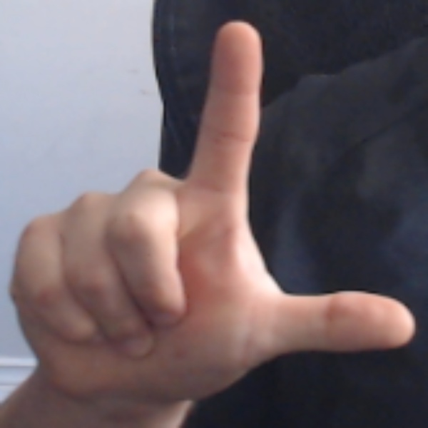
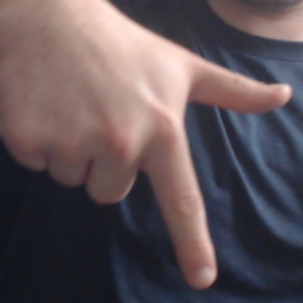
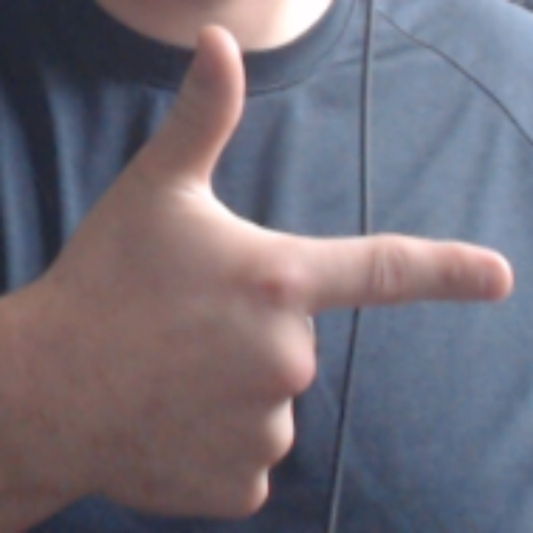
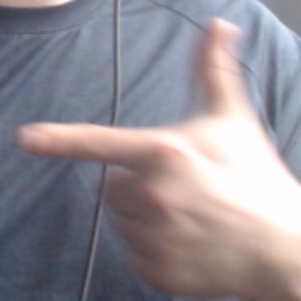
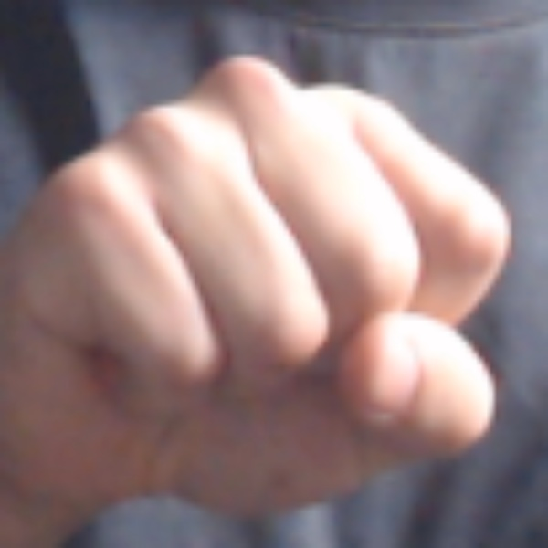

# HandControl

## The Repository 

This repository is a proof of concept for CNN based game controllers. The source code is available for everyone under the MIT license.

## HandControl Screenshots


The server returning sign predictions.

### Trained Controller Signs

Up



Down



Left



Right



Select



## Install Guide

### Prerequisites

Software: 

- [git](https://git-scm.com/book/en/v2/Getting-Started-Installing-Git) 

- Terminal emulator of your choice.

- [Python](https://www.python.org/downloads/) and PIP

Hardware: 

- A webcam connected to the computer you're running the client on.

### Cloning The Repository

This command will clone the repository into your current working directory under the HandControl folder. I recommend cloning projects into a generic "Repos" directory. In general clone it into a directory where you'll be able to quickly remove the code from your machine.
```
git clone https://github.com/Mathieu-Poirier/HandControl
```
Change directory into HandControl.
```
cd HandControl
```
### Packages
To install the required Python packages run this command while in the HandControl directory.
```
pip install -r packages.txt
```
### Running The Client
Change directory into the client folder.
```
cd client
```
Run the client script
```
python .\client_async.py
```
To exit the client press the "q" key on your keyboard or click the 'X' button on the Tic-Tac-Toe GUI

## The Server Design

The server is a flask app that loads the file "converged_CNN.pth". Throught the /predict endpoint it receives the image sent by a client in a POST request and returns a json reponse of the gesture detected.
```
@app.route("/predict", methods=["POST"])
def predict():
    try:
        if "image" not in request.files:
            return jsonify({"error": "No image provided"}), 400

        file = request.files["image"].read()

        image = Image.open(io.BytesIO(file)).convert("RGB")
        image = image.resize((600, 600), Image.ANTIALIAS)

        image = np.array(image).astype(np.float32) / 255.0
        image = np.transpose(image, (2, 0, 1))  # Convert to CHW format
        image = np.expand_dims(image, axis=0)  # Add batch dimension
        image = torch.tensor(image, dtype=torch.float32).to(device)

        with torch.no_grad():
            outputs = model(image)
            _, predicted = torch.max(outputs, 1)
            gesture = class_labels[predicted.item()]

        # Update predictions list
        predictions.append(gesture)
        if len(predictions) > 5:
            predictions.pop(0)

        # Determine the most frequent prediction
        most_common_prediction = Counter(predictions).most_common(1)[0][0]

        return jsonify({"gesture": most_common_prediction})

    except Exception as e:
        print("An error occurred:", e)
        return "Internal Server Error", 500
```
- This snippet is from server.py.

The returned json response is used by the client to control game actions. The responses are aggregated and smoothed by taking the five most frequent predicted gestures.
The flask app is running in a docker container through AWS EC2 and AWS container repository.

## The Model Design

```
self.conv1 = nn.Conv2d(3, 32, kernel_size=3, stride=1, padding=1)
# This will apply a 2 dimensional convolution over an input signal which are our hand images, ultimately it converts the input singal into tensors for further processing.

self.bn1 = nn.BatchNorm2d(32)
# Normalizes layer inputs (constrains input values) and allows for less parameter configuration.

self.pool = nn.MaxPool2d(kernel_size=2, stride=2, padding=0)
# Optimizes the features that the CNN is looking for in the image.

self.dropout = nn.Dropout(0.5)
# Randomly zeroes out some values to prevent overfitting.

self.fc1 = nn.Linear(64 * 150 * 150, 128)
# The vector is resized to 128 after optimizing the feature map.

```
Function for our forward passes:
```
def forward(self, x):
    x = self.pool(F.relu(self.bn1(self.conv1(x))))

    x = self.pool(F.relu(self.bn2(self.conv2(x))))

    x = x.view(-1, 64 * 150 * 150)

    x = self.dropout(F.relu(self.fc1(x)))

    x = self.fc2(x)

    return x
```

This defines the order data will pass through our previous layers, making a forward pass.

## Issues And Further Steps

- Limited dataset diversity: The model was trained on 2500 images of each gesture [up, down, left, right, select] from my own hand, hence the model will probably be accurate only for my hand.
- Async processing and game speeds: In order to uncap the framerate when sending images to the server, I made the program poll for frames in a way that does not interrupt other processes but this creates difficult timing for quickly switching between hand signs.
- GPU acceleration: I had settled on 600x600 images for training since it could capture the full hand detail, but this proves costly if the model is not GPU or TPU accelerated. Training time can take multiple days.

## A Note On Accuracy

- Initally the model did not work without human intervention. I was able to use an assisted training method to manually update weights after the inital training and validation phase. I would receive predictions from the model and correct it by using the keyboard to give it the correct label.
- This had the result of increasing accuracy on unseen input and reduced overfitting drastically

## Credit

Thank you to baraltech for the Tic-Tac-Toe game base code [Video](https://www.youtube.com/watch?v=IL_PMGVxEUY)
